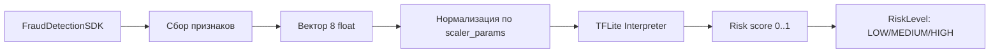

# Разделы пояснительной записки: ML-модель оценки риска мошенничества

Ниже — готовые формулировки для пунктов 1.4, 2.4, 3.3, 4.7 и 4.8 с диаграммами, таблицами и указаниями на иллюстрации. Нумерация листингов и приложений в сносках приведена условно; при вставке в ПЗ её следует заменить на фактическую (по вашим Приложениям и Листингам).

---

## 1.4. Анализ подходов к машинному обучению для скоринга риска мошенничества

### 1.4.1. Бинарная классификация

Задача обнаружения мошенничества формулируется как **бинарная классификация**: объект (транзакция, сессия, устройство) относится либо к классу «мошенничество» (positive, метка 1), либо к классу «норма» (negative, метка 0). Модель выдаёт не жёсткую метку, а **вероятность принадлежности к классу мошенничества** p ∈ [0, 1], что позволяет задавать пороги и градации риска (низкий / средний / высокий).

**Рекомендуемая иллюстрация (взять из интернета):**  
Найти по запросу *«binary classification confusion matrix»* или *«бинарная классификация схема»* — подойдёт схема с матрицей ошибок (TP, TN, FP, FN) или рисунок «два класса и разделяющая граница».

### 1.4.2. Признаковое пространство

Входом модели служит **вектор признаков** (feature vector), описывающий устройство и окружение. Признаки формируются из данных, собираемых SDK:

| Группа признаков   | Примеры признаков                          | Источник в SDK                    |
|--------------------|--------------------------------------------|------------------------------------|
| Безопасность       | `is_rooted` (0/1)                          | `isDeviceRooted()`                 |
| Контакты           | `log_contact_count`                        | `getContactCount()`                |
| Сеть               | `wifi_networks_count`                      | `getWiFiNetworks().size`           |
| Биометрия          | `has_biometric` (0/1)                      | `getBiometricInfo()`               |
| Устройство/ОС      | `sdk_version_norm`                         | `Build.VERSION.SDK_INT`            |
| Телефония          | `is_call_active` (0/1)                     | `isCallActive()`                   |
| Время              | `hour_of_day_norm`, `day_of_week_norm`    | Передаётся из приложения           |

Размерность пространства в данной реализации — **8 признаков**. Перед обучением признаки нормализуются (например, StandardScaler: вычитание среднего и деление на стандартное отклонение), чтобы ускорить сходимость и стабилизировать обучение нейросети. Источники данных для признаков (сбор информации об устройстве, root, контактах, Wi‑Fi, биометрии, звонке) реализованы в модуле FraudDetectionSDK; см. Листинги 1, 2 Приложения 2.

**Рекомендуемая иллюстрация:**  
Рисунок «feature space» или «признаковое пространство» — облако точек в 2D/3D с подписью осей (можно упрощённо изобразить два класса разными цветами).

### 1.4.3. On-device ML и TensorFlow Lite

**On-device ML** — выполнение модели машинного обучения непосредственно на устройстве (смартфоне), без обязательной отправки сырых данных на сервер. Преимущества: низкая задержка, экономия трафика, повышение конфиденциальности (признаки не покидают устройство при инференсе).

**TensorFlow Lite (TFLite)** — фреймворк от Google для запуска моделей на мобильных и встраиваемых устройствах. Обученная модель (Keras/TensorFlow) конвертируется в компактный формат `.tflite`, который загружается в приложение и выполняется через API Interpreter.

Схема использования:

```
[Обучение на сервере/ПК]  →  модель .tflite  →  [Помещение в assets приложения]
                                                          ↓
[Устройство: загрузка модели из assets → нормализация признаков → Interpreter.run() → risk score]
```

**Рекомендуемые иллюстрации (взять из интернета):**  
1. Официальная схема «TensorFlow Lite workflow» с сайта tensorflow.org/lite (конвертация и деплой).  
2. Рисунок «on-device machine learning» — устройство с чипом и подписью «ML on device».

---

## 2.4. Модель машинного обучения для оценки степени риска

### 2.4.1. Постановка задачи

- **Вход:** вектор признаков x из ℝ⁸ (восемь вещественных чисел), сформированный из данных SDK (root, контакты, Wi‑Fi, биометрия, версия ОС, звонок, время).  
- **Выход:** вероятность мошенничества p = P(fraud | x) ∈ [0, 1].  
- **Цель:** по значению p относить сессию/действие к градациям риска (низкий / средний / высокий) для принятия решений в приложении (пропуск, доп. проверка, блокировка).

### 2.4.2. Архитектура MLP

Используется **многослойный перцептрон (MLP)** — полносвязная нейронная сеть с двумя скрытыми слоями:

- Входной слой: 8 нейронов (по числу признаков).  
- Скрытый слой 1: 16 нейронов, функция активации ReLU.  
- Скрытый слой 2: 8 нейронов, ReLU.  
- Выходной слой: 1 нейрон, активация **sigmoid** (выдаёт вероятность).

**Схема архитектуры (можно нарисовать в ПЗ или вставить как изображение):**

```
Вход (8)  →  Dense(16, ReLU)  →  Dense(8, ReLU)  →  Dense(1, sigmoid)  →  p в диапазоне [0, 1]
```

**Рекомендуемая иллюстрация (взять из интернета):**  
По запросу *«MLP neural network architecture diagram»* или *«схема многослойного перцептрона»* — типичная картинка с кружками (нейроны) и линиями (связи) между слоями; можно подписать «Input 8», «Hidden 16», «Hidden 8», «Output 1».

### 2.4.3. Функция потерь и метрики качества

- **Функция потерь:** **Binary cross-entropy** (бинарная кросс-энтропия). Для метки y ∈ {0, 1} и предсказанной вероятности p̂ формула потерь: L = −y·ln(p̂) − (1−y)·ln(1−p̂). Минимизация этой функции в процессе обучения соответствует максимизации правдоподобия для бинарной классификации.

- **Метрика качества:** **AUC (Area Under ROC Curve)** — площадь под кривой «False Positive Rate vs True Positive Rate». Значение AUC от 0.5 до 1.0; чем выше AUC, тем лучше модель отделяет класс «мошенничество» от «нормы». Для синтетических данных в проекте ожидаются значения AUC порядка 0.8–0.95 в зависимости от правил генерации и объёма данных.

**Рекомендуемая иллюстрация (взять из интернета):**  
Рисунок *«ROC curve AUC»* — график с кривой ROC и заштрихованной площадью AUC.

### 2.4.4. Конвертация в TensorFlow Lite

Обученная модель Keras сохраняется, затем конвертируется в TFLite с помощью `TFLiteConverter`. Применяются оптимизации по умолчанию (квантизация и т.п.) для уменьшения размера и ускорения на устройстве. Результат — файл `fraud_risk_model.tflite`, помещаемый в `assets` модуля SDK. Параметры нормализации признаков (средние и масштабы StandardScaler) сохраняются в `scaler_params.json` и используются на устройстве для приведения входного вектора к тому же виду, что и при обучении.

---

## 3.3. Проектирование модуля оценки риска (Risk Scorer)

### 3.3.1. Назначение модуля

Модуль **FraudRiskScorer** отвечает за:  
1) загрузку TFLite-модели и параметров нормализации из ресурсов приложения;  
2) формирование вектора признаков из данных **FraudDetectionSDK**;  
3) нормализацию вектора и выполнение инференса;  
4) возврат числового risk score и градации риска (LOW / MEDIUM / HIGH).

Реализация модуля FraudRiskScorer (загрузка модели и scaler, формирование вектора признаков, нормализация, вызов Interpreter, определение градации риска) представлена в Листинге 5 Приложения 2.

### 3.3.2. Диаграмма потока данных



*Примечание: Mermaid можно отрендерить в GitHub, в части редакторов Markdown или на сайте mermaid.live; при вставке в Word можно заменить на нарисованную блок-схему по тому же смыслу.*

Текстовая версия потока:

1. Приложение получает экземпляр `FraudDetectionSDK` и `FraudRiskScorer`.  
2. По запросу (например, перед критичным действием) вызывается `evaluateRisk(sdk, hourOfDay, dayOfWeek)`.  
3. FraudRiskScorer запрашивает у SDK: `isDeviceRooted()`, `getContactCount()`, `getWiFiNetworks()`, `getBiometricInfo()`, `isCallActive()`, данные о версии ОС; дополняет признаками времени.  
4. Строится вектор из 8 чисел в фиксированном порядке (как при обучении).  
5. Вектор нормализуется с использованием `scaler_params.json`.  
6. Нормализованный вектор подаётся в TFLite Interpreter; на выходе — одно число (score).  
7. По score определяется градация: например, 0.0–0.3 — LOW, 0.3–0.7 — MEDIUM, 0.7–1.0 — HIGH.  
8. Приложение использует градацию для выбора сценария (пропуск, доп. аутентификация, блокировка).

### 3.3.3. Градации риска и интеграция в поток обнаружения

| RiskLevel | Диапазон score | Рекомендуемое действие в приложении     |
|-----------|----------------|-----------------------------------------|
| LOW       | [0.0; 0.3)     | Пропуск операции без доп. проверок     |
| MEDIUM    | [0.3; 0.7)     | Запрос SMS/push или биометрии           |
| HIGH      | [0.7; 1.0]     | Блокировка или ручная модерация         |

Интеграция: вызов `FraudRiskScorer.evaluateRisk()` в нужных точках приложения (например, при нажатии «Оплатить» или «Подтвердить»), затем ветвление по `getRiskLevel(score)`.

**Рекомендуемая иллюстрация:**  
Небольшая блок-схема «Решение по уровню риска»: три ветки от блока «Risk score» к «Разрешить», «Доп. проверка», «Заблокировать» (нарисовать в draw.io, Visio или от руки).

---

## 4.7. Обучение модели оценки риска и размещение в SDK

### 4.7.1. Подготовка признаков и данные

- Учебные данные для демонстрации генерируются скриптом **generate_synthetic_data.py**: создаётся таблица (CSV) с восемью столбцами признаков и столбцом `label` (0 — норма, 1 — мошенничество). Правила генерации имитируют типичные различия (например, у «мошенников» чаще рут, меньше контактов, больше Wi‑Fi сетей).  
- Признаки соответствуют тем, что в SDK собираются с устройства: `is_rooted`, `log_contact_count`, `wifi_networks_count`, `has_biometric`, `sdk_version_norm`, `is_call_active`, `hour_of_day_norm`, `day_of_week_norm`.  
- В реальном проекте вместо синтетики используются размеченные операционные данные (chargebacks, модерация).

### 4.7.2. Обучение MLP и оценка AUC

- Скрипт **train_and_export.py** загружает CSV, разбивает выборку на train/test, применяет **StandardScaler** к признакам.  
- Обучается модель Keras: архитектура MLP (8 → 16 → 8 → 1), оптимизатор Adam, функция потерь binary cross-entropy.  
- После обучения на тестовой выборке вычисляется **AUC**; значение выводится в консоль.  
- Результат обучения: обученная модель в формате Keras и параметры scaler (mean, scale).

Реализация обучения модели и экспорта в TFLite (включая расчёт AUC) представлена в Листинге 7 Приложения 3.

### 4.7.3. Конвертация в TensorFlow Lite и размещение в ресурсах SDK

- С помощью **TFLiteConverter** модель конвертируется в формат `.tflite`; при необходимости задаются оптимизации.  
- Файл **fraud_risk_model.tflite** и файл **scaler_params.json** (средние и масштабы по каждому признаку) размещаются в каталоге **fraud-detection-sdk/src/main/assets/**.  
- При сборке Android-приложения эти файлы попадают в APK и доступны FraudRiskScorer через `context.assets` (реализация чтения из assets — в Листинге 5 Приложения 2).

**Рекомендуемая иллюстрация:**  
Схема пайплайна: «CSV → train_and_export.py → fraud_risk_model.tflite + scaler_params.json → копирование в assets/» (простая блок-схема или таблица шагов).

---

## 4.8. Реализация on-device скоринга в SDK

### 4.8.1. Загрузка TFLite-модели и параметров нормализации

- В **FraudRiskScorer** при инициализации из `assets` читаются файлы **fraud_risk_model.tflite** (в `MappedByteBuffer`) и **scaler_params.json**.  
- Создаётся экземпляр **Interpreter** (TensorFlow Lite) для загруженной модели.  
- Из JSON извлекаются массивы `mean` и `scale` для нормализации входного вектора (та же формула, что и в Python: `(x - mean) / scale`).

Если файлы отсутствуют, модуль помечает модель как незагруженную; при вызове `evaluateRisk()` возвращается `null` или выводится сообщение пользователю. Реализация загрузки TFLite-модели и параметров нормализации представлена в Листинге 5 Приложения 2.

### 4.8.2. Расчёт risk score по собранным признакам

- По данным **FraudDetectionSDK** и опциональным параметрам (час, день недели) формируется вектор из 8 float в том же порядке, что и при обучении.  
- Вектор нормализуется с использованием загруженных mean/scale.  
- Нормализованный вектор записывается в `ByteBuffer` и передаётся в `Interpreter.run()`.  
- Результат интерпретатора — одно число (вероятность); оно приводится к диапазону [0, 1] и возвращается как risk score.

### 4.8.3. Использование градаций риска в логике приложения

- По числовому score вызывается метод **getRiskLevel(score)**, возвращающий enum **RiskLevel** (LOW, MEDIUM, HIGH).  
- В демо-приложении при нажатии «Рассчитать риск» отображаются score и текстовая интерпретация уровня риска; при необходимости показывается Toast.  
- В реальном приложении на основе уровня риска выбирается сценарий: разрешить операцию, запросить дополнительную аутентификацию или отклонить операцию и залогировать событие для анализа.

Вызов расчёта риска и отображение результата (карточка «ML Risk Score», кнопка «Рассчитать риск») в демо-приложении представлены в Листинге 8 Приложения 2.

**Рекомендуемая иллюстрация:**  
Скриншот экрана демо-приложения с карточкой «ML Risk Score» и кнопкой «Рассчитать риск», с подписью «Отображение risk score и градации риска в демо-приложении».

---

## Сводка рекомендуемых иллюстраций из интернета

| Раздел  | Что искать / откуда взять |
|---------|----------------------------|
| 1.4     | «Binary classification», «confusion matrix»; «feature space»; «TensorFlow Lite workflow» (tensorflow.org/lite), «on-device ML» |
| 2.4     | «MLP neural network architecture», «многослойный перцептрон схема»; «ROC curve AUC» |
| 3.3     | Блок-схема «решение по уровню риска» (можно нарисовать по тексту раздела) |
| 4.7     | Схема пайплайна: CSV → обучение → .tflite + scaler → assets |
| 4.8     | Скриншот своего приложения с карточкой ML Risk Score |

Все диаграммы в этом файле (Mermaid и текстовые схемы) можно заменить на рисунки, нарисованные в draw.io, Microsoft Visio или от руки и отсканированные, с подписями «Рис. X. …» в соответствии с требованиями к оформлению ПЗ.
